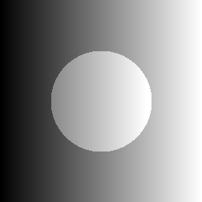
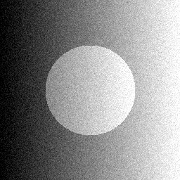
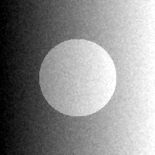

# Лабораторная работа №9 — Анализ шума изображения

**Вариант 14**

## Цель
Смоделировать шум на изображении, оценить его параметры и показать, что после фильтрации качество улучшается (на числах).

## Краткая теория
- Для изображения считаются базовые статистики: `mean`, `var`, `std`, `min/max`.
- Для сравнения с эталоном (clean) используются:
  - `MSE = mean((I - K)^2)`
  - `PSNR = 10 * log10(255^2 / MSE)` (чем больше — тем лучше)
- Оценка уровня шума (примерно для аддитивного гауссовского):  
  `sigma ≈ 1.4826 * MAD(I - median(I))`

## Что сделано (вариант 14)
- Тип шума: **Gaussian** с `sigma = 14`
- Фильтрация: **median 3×3**
- Все параметры лежат в `config/variant14.json`

## Запуск
1) Установка:
`pip install -r requirements.txt`

2) Демо (генерация clean → noisy → denoised + расчёт метрик):
`python src/main.py --demo`

После запуска создаются файлы в `assets/` и сохраняется полный отчёт `assets/demo_results.json`.

## Демонстрация работы
| Clean (вход) | Noisy (после добавления шума) | Denoised (после фильтра) |
|---|---|---|
|  |  |  |

Смысл: после фильтрации `PSNR` относительно clean становится выше, а оценка `sigma` уменьшается.  
Пример из `assets/demo_results.json`: `PSNR` ≈ `25.50 dB` → `32.85 dB`.

## Файлы
- `src/noise_analysis.py` — шум, фильтрация, метрики, оценка `sigma`
- `src/main.py` — CLI (демо + отчёт)
- `config/variant14.json` — параметры варианта 14
