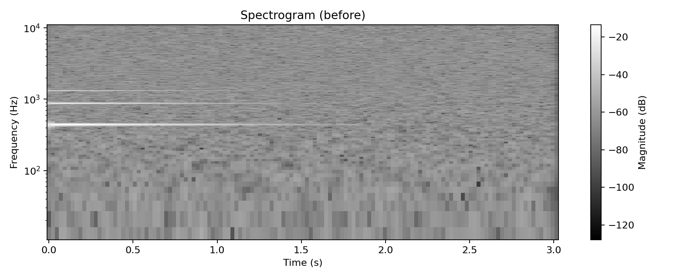
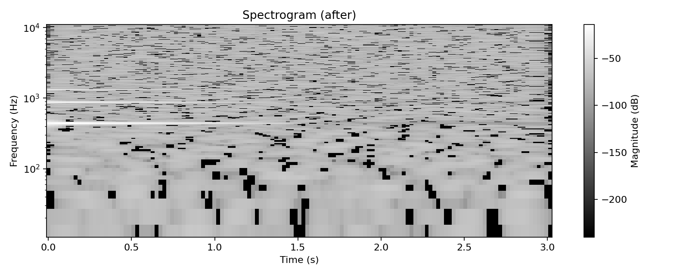

# Лабораторная работа №9 — Анализ шума в аудиосигнале (STFT спектрограмма)

**Вариант 14**

## Что реализовано
- Загрузка аудио → перевод в **моно** (если стерео).
- STFT: окно **Hann**, `n_fft=2048`, `hop=512` (настройки в `config/lab9_config.json`).
- Спектрограмма сохраняется в PNG, частоты отображаются на **log-scale**.
- Оценка уровня шума: **медиана по времени** для каждой частоты (noise profile).
- Подавление шума по умолчанию: **spectral subtraction** + сглаживание **Savitzky–Golay** по времени.
- Восстановление звука (обратное STFT) → `outputs/denoised.wav`.
- Поиск моментов максимальной энергии: агрегирование спектра в полосы по **50 Гц** и по времени окнами **0.1 с** → топ-пики.

## Запуск
1) Установка:
`pip install -r requirements.txt`

2) Демо (создаст синтетический пример и все картинки/отчёт):
`python src/main.py --demo`

3) Для своего файла:
`python src/main.py --input path/to/record.wav`

Если у вас MP3: лучше конвертировать в WAV (моно) через ffmpeg:  
`ffmpeg -i input.mp3 -ac 1 -ar 22050 record.wav`

## Демонстрация (до/после)
Спектрограммы сохранены в `assets/`:

| До подавления | После подавления |
|---|---|
|  |  |

Сравнение рядом: `assets/spectrogram_compare.png`  
Отчёт с найденными энергетическими пиками (Δt=0.1с, Δf=50Гц): `assets/demo_report.json`

## Файлы
- `src/audio_lab9.py` — STFT/ISTFT, оценка шума, spectral subtraction, пики энергии
- `src/plotting.py` — сохранение спектрограмм (лог-шкала частот)
- `src/main.py` — CLI (демо + запуск на своём WAV)
- `config/lab9_config.json` — параметры варианта 14
