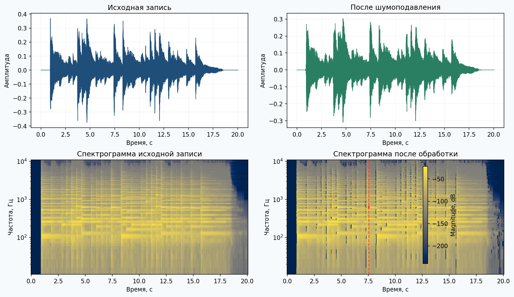
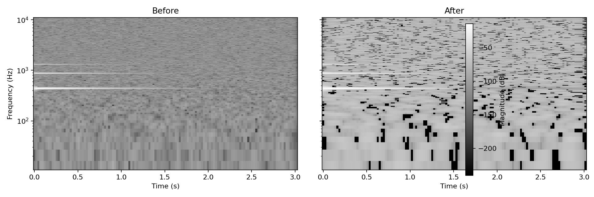
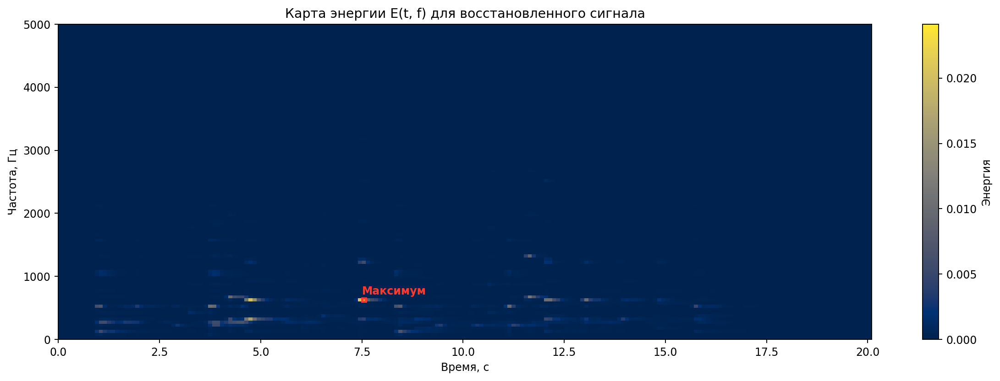

# Анализ шума музыкальной записи

Лабораторная работа №9 по анализу шума в аудиосигнале. В качестве исходных данных использована запись пианино `piano.mp3`. Файл был приведён к моноформату и частоте дискретизации `22050 Гц`, после чего для анализа применено оконное преобразование Фурье с окном Ханна.

## Исходные данные

| Параметр | Значение |
|---|---:|
| Исходный файл | `piano.mp3` |
| Формат | MP3, stereo |
| Исходная частота дискретизации | 44100 Гц |
| Частота после конвертации | 22050 Гц |
| Длительность | 20.05 с |
| Каналы после подготовки | mono |
| FFT | 2048 |
| Hop length | 512 |
| Окно | Hann |
| Шаг по времени для карты энергии | 0.1 с |
| Шаг по частоте для карты энергии | 50 Гц |

Подготовленные аудиофайлы:

- Исходник в репозитории: `assets/piano.mp3`
- Моно-версия для анализа: `assets/piano_mono_22050.wav`
- Восстановленный сигнал после шумоподавления: `assets/piano_denoised.wav`

## Как оценивался шум

Шумовой профиль оценивался по `15%` наименее энергичных STFT-окон. Для каждого частотного бина бралась медиана по этим тихим окнам, затем выполнялось спектральное вычитание:

```text
X(m, k) = Σ x[n] · w[n - mH] · exp(-j·2πkn/N)
|Ŝ(m, k)| = max(|X(m, k)| - α·N(k), β·|X(m, k)|)
E(t, f) = Σ |X(t, f)|² по ячейке Δt × Δf
```

Где:

- `w` — окно Ханна;
- `N(k)` — оценка шумового профиля;
- `α = 1.0` — коэффициент вычитания;
- `β = 0.02` — спектральный пол, не дающий спектру схлопнуться в ноль;
- после вычитания модуль спектра дополнительно сглаживался фильтром Савицкого-Голея.

## Численные результаты

| Показатель | Значение |
|---|---:|
| Тихих окон для оценки шума | 125 |
| RMS шума до обработки | `9.73e-06` |
| RMS шума после обработки | `6.48e-06` |
| Медианный спектральный пол до, дБ | `-154.14` |
| Медианный спектральный пол после, дБ | `-157.06` |
| RMS исходного сигнала | `0.04273` |
| RMS после обработки | `0.04111` |
| PSNR между исходным и восстановленным сигналом | `44.17 дБ` |

Глобальный максимум карты энергии `E(t, f)` найден в ячейке:

- Время: `7.50–7.60 с`
- Частота: `600–650 Гц`
- Энергия: `0.02413`

## Осциллограммы и спектрограммы



Для сравнения в репозитории также сохранена отдельная пара спектрограмм до/после:



## Карта энергии и максимумы



Наиболее энергичные интервалы после шумоподавления:

| № | t0, c | t1, c | f0, Гц | f1, Гц | Энергия |
|---:|---:|---:|---:|---:|---:|
| 1 | 7.50 | 7.60 | 600 | 650 | 0.02413 |
| 2 | 7.40 | 7.50 | 600 | 650 | 0.02063 |
| 3 | 4.70 | 4.80 | 600 | 650 | 0.02054 |
| 4 | 4.70 | 4.80 | 300 | 350 | 0.01638 |
| 5 | 4.80 | 4.90 | 600 | 650 | 0.01442 |
| 6 | 11.60 | 11.70 | 650 | 700 | 0.01122 |
| 7 | 4.60 | 4.70 | 600 | 650 | 0.01116 |
| 8 | 4.60 | 4.70 | 300 | 350 | 0.01085 |
| 9 | 3.70 | 3.80 | 500 | 550 | 0.01033 |
| 10 | 12.10 | 12.20 | 600 | 650 | 0.01025 |

## Выводы

- Для выполнения лабораторной использована реальная запись пианино, а не синтетический демо-сигнал.
- Спектральное вычитание по тихим окнам уменьшило фон: и RMS шума, и оценка медианного спектрального пола стали ниже.
- На карте энергии самые сильные события сосредоточены в области `300–700 Гц`, что соответствует основной энергетике записи пианино.
- Алгоритм находит моменты максимальной энергии с требуемыми шагами `Δt = 0.1 с` и `Δf = 50 Гц`, а их положение визуально подтверждается на спектрограммах и карте `E(t, f)`.

## Структура репозитория

- `src/audio_lab9.py` — загрузка аудио, STFT/ISTFT, оценка шума, подавление шума, расчёт карты энергии.
- `src/plotting.py` — построение спектрограмм, обзорной фигуры и карты энергии.
- `src/main.py` — запуск анализа и формирование итогового JSON-отчёта.
- `config/lab9_config.json` — параметры эксперимента.
- `assets/piano_report.json` — все численные результаты в машиночитаемом виде.

## Запуск

```bash
pip install -r requirements.txt
python src/main.py --input ../piano.mp3 --json-out assets/piano_report.json
```
